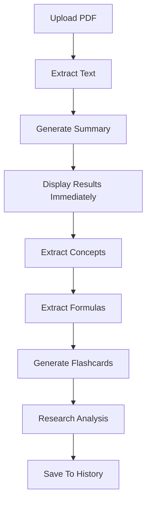
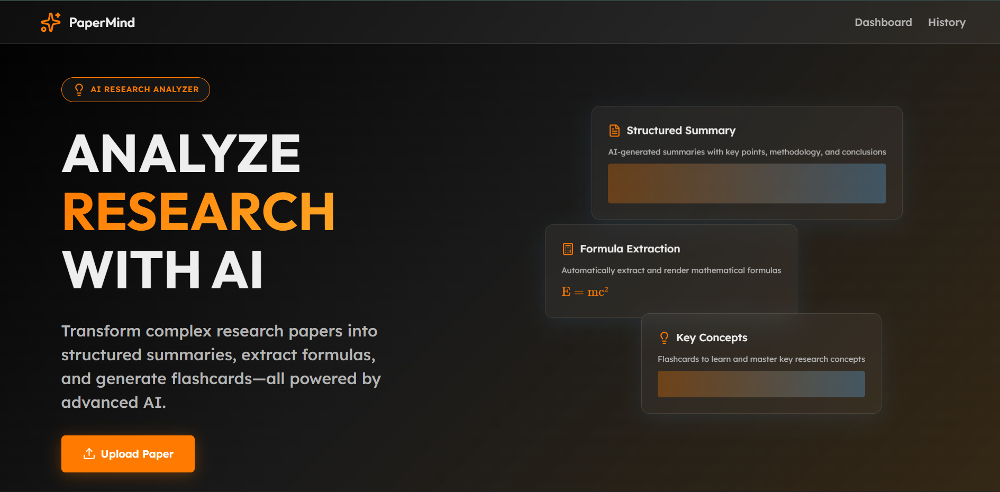
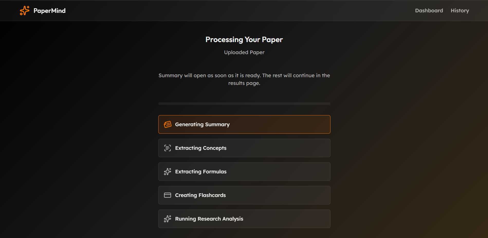
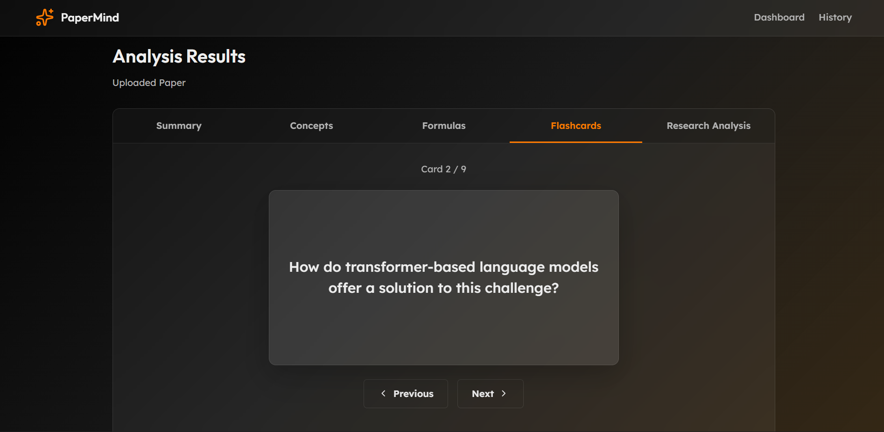

# 🧠 PaperMind – AI Research Paper Analyzer

### AI-Powered PDF Analysis, Research Insights & Study Assistant


---

# 📖 Overview

**PaperMind** is a local AI-powered research paper analysis platform that transforms lengthy PDFs into structured, easy-to-understand knowledge.

Instead of spending hours reading academic papers, technical reports, journals, and documentation, users can upload a PDF and instantly receive:

- AI-generated summaries
- Key concept extraction
- Formula identification
- Interactive flashcards
- Research gap analysis
- Limitation detection
- Future work suggestions

All AI processing runs locally using **Ollama**, ensuring privacy, zero API costs, and complete control over your data.

---

# ⭐ Key Highlights

- Local AI-powered PDF analysis using Ollama
- Research paper summarization and gap detection
- Formula extraction and explanation
- Interactive flashcard generation
- Progressive content loading for improved UX
- Local history system with persistent results
- Fully self-hosted architecture
- No cloud AI dependency
- No API costs
- Privacy-first processing

---

# 🎯 Purpose

Researchers, students, engineers, and professionals often spend significant time extracting useful information from long technical documents.

PaperMind helps users:

- Understand papers faster
- Reduce reading time
- Generate study material automatically
- Identify research opportunities
- Extract formulas and concepts instantly
- Improve learning and retention

---

# ✨ Features

## 📄 Intelligent PDF Processing

- Upload academic papers and technical documents
- Automatic text extraction
- Multi-page PDF support
- Local document analysis
- Fast processing pipeline

---

## 🧠 AI-Powered Summaries

Generate structured summaries containing:

- Overview
- Main Ideas
- Key Findings
- Important Contributions
- Conclusions

Understand a paper within minutes.

---

## 🔍 Concept Extraction

Automatically identifies:

- Important concepts
- Core topics
- Technical terminology
- Key themes

Ideal for quick understanding and revision.

---

## 📐 Formula Extraction

Detects:

- Mathematical equations
- Scientific formulas
- Engineering expressions
- Important laws and relationships

Each formula includes AI-generated explanations.

---

## 🎴 Interactive Flashcards

PaperMind automatically converts paper content into study cards.

Features:

- Question side
- Answer side
- Flip animations
- Previous / Next navigation
- Learning-focused interface

Perfect for revision and exam preparation.

---

## 🔬 Research Analysis

When a research paper is detected, PaperMind generates:

### Limitations

Identifies weaknesses and constraints within the study.

### Research Gaps

Highlights unexplored opportunities and missing investigations.

### Future Work

Suggests logical directions for future research.

---

## 💾 Local History System

All completed analyses are saved locally.

Stored Information:

- PDF Name
- Analysis Date
- Summary
- Concepts
- Formulas
- Flashcards
- Research Analysis

Users can reopen previous analyses instantly without reprocessing PDFs.

---

# 🏗 Architecture

```text
Frontend (React + TypeScript)
            │
            ▼
      Flask Backend
            │
            ▼
    PDF Text Extraction
            │
            ▼
      Ollama AI Model
            │
            ▼
 ┌───────────────────────┐
 │ Summary               │
 │ Concepts              │
 │ Formulas              │
 │ Flashcards            │
 │ Research Analysis     │
 └───────────────────────┘
            │
            ▼
    Local History Storage
```

---

# ⚙️ Processing Pipeline



---

# 🛠 Technology Stack

## Frontend

- React
- TypeScript
- React Router
- Vite
- CSS Modules
- Lucide React

---

## Backend

- Python
- Flask
- Flask-CORS

---

## AI Layer

- Ollama
- Llama 3.2

---

## PDF Processing

- PyMuPDF (fitz)
- Text Extraction Pipeline

---

## Storage

- Browser LocalStorage
- Local Analysis History

---

# 📸 Screenshots

### Dashboard



### Processing



### Flashcards



---

# 🤖 Why Local AI?

PaperMind runs entirely on your machine using Ollama.

Benefits:

- No API charges
- No internet dependency after setup
- Better privacy
- Faster development workflow
- Full control over AI models
- Works offline

---

# 📦 Installation & Setup

## 1. Clone Repository

```bash
git clone https://github.com/d-ghosh717/PaperMind.git

cd PaperMind
```

---

## 2. Install Frontend Dependencies

```bash
cd frontend

npm install
```

---

## 3. Install Backend Dependencies

```bash
cd backend

pip install -r requirements.txt
```

---

## 4. Install Ollama

Download and install:

https://ollama.com

---

## 5. Pull AI Model

Recommended:

```bash
ollama pull llama3.2:3b
```

For low-RAM systems:

```bash
ollama pull llama3.2:1b
```

---

# ▶ Running The Project

## Start Ollama

```bash
ollama serve
```

---

## Start Backend

```bash
cd backend

python app.py
```

Backend URL:

```text
http://localhost:5000
```

---

## Start Frontend

```bash
cd frontend

npm run dev
```

Frontend URL:

```text
http://localhost:5173
```

---

# 🔗 API Endpoints

## Upload PDF

```http
POST /upload
```

Uploads and starts analysis.

---

## Summary

```http
GET /summary/<pdf_id>
```

Returns generated summary.

---

## Concepts

```http
GET /concepts/<pdf_id>
```

Returns extracted concepts.

---

## Formulas

```http
GET /formulas/<pdf_id>
```

Returns identified formulas.

---

## Flashcards

```http
GET /flashcards/<pdf_id>
```

Returns generated flashcards.

---

## Research Analysis

```http
GET /research/<pdf_id>
```

Returns:

- Limitations
- Research Gaps
- Future Work

---

# 🚀 Performance Recommendations

Minimum:

- 8 GB RAM
- SSD Storage
- Python 3.10+

Recommended:

- 16 GB RAM
- Multi-core CPU
- SSD Storage

Best model for 8 GB RAM:

```text
llama3.2:3b
```

---

# 🛠 Troubleshooting

## Ollama Not Running

Verify:

```bash
ollama list
```

and

```bash
ollama run llama3.2:3b
```

---

## Upload Failure

Verify:

- Backend running on port 5000
- Flask server started successfully
- CORS enabled

---

## Empty Results

Ensure:

- PDF contains selectable text
- Ollama model is installed
- Ollama service is running

---

## Slow Processing

Large PDFs may require:

- More RAM
- Smaller Ollama model
- Document chunking

---

# 🎯 Development Roadmap

## ✅ Completed

- PDF Upload System
- Local AI Integration
- Summary Generation
- Concept Extraction
- Formula Extraction
- Flashcard Generation
- Research Gap Detection
- Local History Storage
- Progressive Loading Pipeline
- Modern Dashboard UI

---

## 🚧 In Progress

- Better Formula Rendering
- Faster Processing Pipeline
- Improved PDF Chunking
- Enhanced Research Analysis

---

## 📅 Planned

- AI Chat With PDF
- Citation Extraction
- Multi-PDF Comparison
- Semantic Search
- Knowledge Graph Generation
- Export To PDF
- Anki Flashcard Export
- Research Recommendation Engine

---

# 🤝 Contributing

Contributions are welcome.

1. Fork the repository
2. Create a feature branch
3. Make your changes
4. Test locally
5. Open a pull request

---

# 📜 License

This project is intended for educational, research, and portfolio purposes.

---

# 👨‍💻 Author

PaperMind was built as a local-first AI research assistant designed to help students, researchers, engineers, and professionals extract actionable knowledge from technical documents quickly and efficiently.